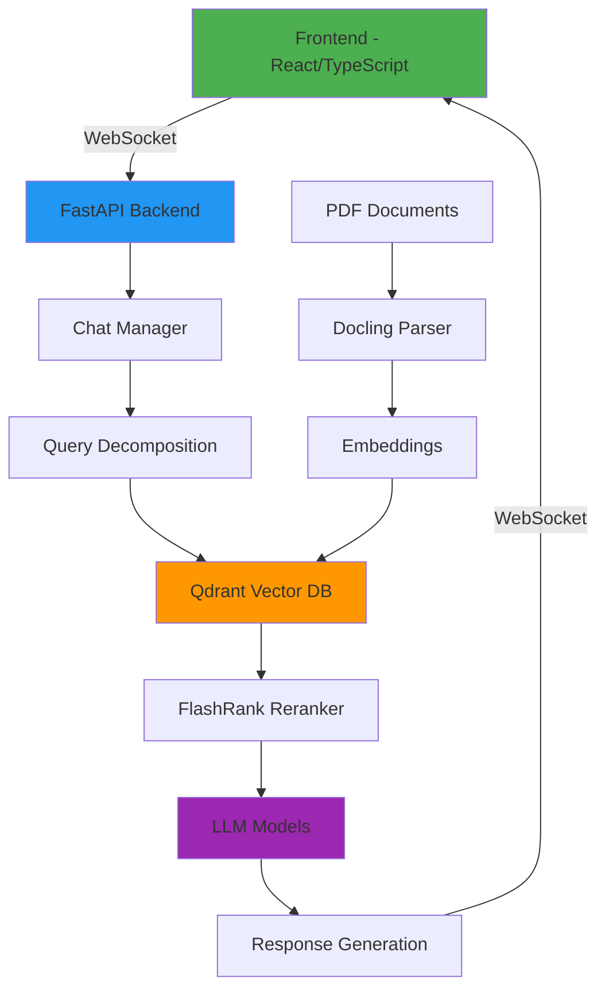

# 🐝 BeeBot RAG Chatbot - Project Management

<div align="center">


**AI-Powered RAG Chatbot for Data Science Queries**

[Features](#-features) • [Architecture](#-architecture) • [Roadmap](#-roadmap) • [Tasks](#-current-tasks) • [Bugs](#-bug-tracker)

</div>

---

## 📊 Project Overview

BeeBot is an intelligent chatbot leveraging Retrieval-Augmented Generation (RAG) to answer data science queries using a curated knowledge base of technical documents.

### Key Metrics

| Metric                | Value                | Status       |
| --------------------- | -------------------- | ------------ |
| **Documents Indexed** | 50+ PDFs             | ✅ Active     |
| **Vector Database**   | Qdrant               | ✅ Running    |
| **LLM Models**        | 3 (Flash, Pro, Grok) | ✅ Integrated |
| **Response Time**     | ~5-6s                | ⚠️ Optimizing |
| **Test Coverage**     | 12/12 passing        | ✅ Good       |

---

## 🎯 Features

### ✅ Implemented

- [x] **Multi-Model Support** - Google Flash, Google Pro, OpenRouter Grok
- [x] **RAG Pipeline** - Query decomposition, retrieval, reranking
- [x] **Image Display** - Diagrams from PDFs shown in chat
- [x] **Chat Sessions** - Multi-session support with localStorage
- [x] **Project Management** - Built-in dashboard for tracking
- [x] **WebSocket API** - Real-time chat communication
- [x] **Responsive UI** - Mobile and desktop support

### 🚧 In Progress

- [ ] **PostgreSQL Integration** - Persistent data storage
- [ ] **Response Time Optimization** - Target <3s
- [ ] **User Authentication** - Multi-user support
- [ ] **Advanced Analytics** - Usage tracking and insights

### 💡 Planned

- [ ] **Voice Input** - Speech-to-text for queries
- [ ] **Export Functionality** - Save conversations as PDF/MD
- [ ] **Custom Knowledge Base** - User-uploaded documents
- [ ] **API Rate Limiting** - Prevent abuse
- [ ] **Caching Layer** - Redis for frequent queries

---

## 🏗️ Architecture



### Tech Stack

#### Backend
- **Framework**: FastAPI (Python 3.9+)
- **Vector DB**: Qdrant
- **LLMs**: Google Gemini, OpenRouter
- **Embeddings**: OpenRouter
- **Reranking**: FlashRank

#### Frontend
- **Framework**: React 18 + TypeScript
- **Styling**: Tailwind CSS
- **Icons**: Lucide React
- **State**: React Hooks + localStorage

---

## 🗓️ Roadmap

### Q1 2025

#### January
- [x] Fix model selection bug
- [x] Implement image display
- [x] Add project management dashboard
- [ ] Integrate PostgreSQL
- [ ] Add user authentication

#### February
- [ ] Optimize response time (<3s)
- [ ] Implement caching layer
- [ ] Add export functionality
- [ ] Deploy to production

#### March
- [ ] Voice input support
- [ ] Custom knowledge base upload
- [ ] Advanced analytics dashboard
- [ ] API documentation

### Q2 2025
- [ ] Mobile app (React Native)
- [ ] Multi-language support
- [ ] Team collaboration features
- [ ] Enterprise features

---

## ✅ Current Tasks

### High Priority

- [ ] **PostgreSQL Integration**
  - [ ] Design database schema
  - [ ] Create SQLAlchemy models
  - [ ] Implement API endpoints
  - [ ] Migrate from localStorage
  - [ ] Add migration scripts

- [ ] **Response Time Optimization**
  - [ ] Profile query decomposition
  - [ ] Optimize retrieval queries
  - [ ] Implement caching
  - [ ] Reduce sub-query count
  - [ ] Benchmark improvements

### Medium Priority

- [ ] **User Authentication**
  - [ ] Choose auth strategy (JWT/OAuth)
  - [ ] Implement login/signup
  - [ ] Add session management
  - [ ] Protect API endpoints

- [ ] **Testing & Documentation**
  - [ ] Increase test coverage to 90%
  - [ ] Add integration tests
  - [ ] Write API documentation
  - [ ] Create user guide

### Low Priority

- [ ] **UI Enhancements**
  - [ ] Dark/light mode toggle
  - [ ] Keyboard shortcuts
  - [ ] Accessibility improvements
  - [ ] Loading animations

---

## 🐛 Bug Tracker

### 🔴 Critical

*No critical bugs currently*

### 🟡 High Priority

| ID  | Description | Status | Assigned | Updated |
| --- | ----------- | ------ | -------- | ------- |
| -   | -           | -      | -        | -       |

### 🟢 Medium/Low Priority

| ID  | Description | Status | Assigned | Updated |
| --- | ----------- | ------ | -------- | ------- |
| -   | -           | -      | -        | -       |

### ✅ Recently Fixed

| ID   | Description                                       | Fixed Date | PR/Commit                                                                                                         |
| ---- | ------------------------------------------------- | ---------- | ----------------------------------------------------------------------------------------------------------------- |
| #001 | Model selection - all models generating responses | 2025-11-25 | [walkthrough.md](file:///home/anuj/.gemini/antigravity/brain/310e5bd7-9bde-4cde-bc07-c87c4f3444e4/walkthrough.md) |
| #002 | Images not displaying in frontend                 | 2025-11-25 | [walkthrough.md](file:///home/anuj/.gemini/antigravity/brain/310e5bd7-9bde-4cde-bc07-c87c4f3444e4/walkthrough.md) |

---

## 📝 Quick Notes

### Ideas 💡

- Consider implementing streaming responses for better UX
- Add conversation branching (like ChatGPT)
- Implement "suggested questions" based on context
- Add code execution sandbox for Python queries

### Reminders ⏰

- Review and update dependencies monthly
- Monitor API costs (OpenRouter, Google)
- Backup Qdrant database weekly
- Check for security updates

### Technical Debt 🔧

- Hardcoded `localhost` URLs in image serving
- localStorage size limitations for large chat histories
- No error boundary in React components
- Missing request rate limiting

---

## 📈 Performance Metrics

### Current Performance

| Metric              | Current | Target | Status              |
| ------------------- | ------- | ------ | ------------------- |
| Query Response Time | 5-6s    | <3s    | 🟡 Needs Improvement |
| Document Retrieval  | <1s     | <500ms | 🟢 Good              |
| LLM Generation      | 4-5s    | <2s    | 🟡 Needs Improvement |
| UI Load Time        | <1s     | <500ms | 🟢 Excellent         |

### Optimization Opportunities

1. **Query Decomposition** - Currently generates 6 sub-queries, reduce to 3-4
2. **Caching** - Implement Redis for frequent queries
3. **Batch Processing** - Process sub-queries in parallel
4. **Model Selection** - Use faster models for simple queries

---

## 🔐 Security Considerations

### Implemented

- [x] Path traversal protection for file serving
- [x] CORS configuration
- [x] Input validation on backend
- [x] Secure WebSocket connections

### Pending

- [ ] Rate limiting per IP/user
- [ ] API key rotation
- [ ] SQL injection prevention (for PostgreSQL)
- [ ] XSS protection enhancements
- [ ] HTTPS in production

---

## 📚 Resources

### Documentation

- [FastAPI Docs](https://fastapi.tiangolo.com/)
- [Qdrant Docs](https://qdrant.tech/documentation/)
- [LangChain Docs](https://python.langchain.com/)
- [React Docs](https://react.dev/)

### Internal Docs

- [Walkthrough](file:///home/anuj/.gemini/antigravity/brain/310e5bd7-9bde-4cde-bc07-c87c4f3444e4/walkthrough.md) - Bug fixes and implementation details
- [Task List](file:///home/anuj/.gemini/antigravity/brain/310e5bd7-9bde-4cde-bc07-c87c4f3444e4/task.md) - Current task checklist

### Useful Commands

```bash
# Start backend
cd backend && source venv/bin/activate && uvicorn core.main:app --reload

# Start frontend
cd beebot-ai && npm run dev

# Run tests
python3 tests/test_model_selection.py
python3 tests/test_image_display.py

# Check Qdrant
curl http://localhost:6333/collections

# Database backup (future)
pg_dump beebot_db > backup.sql
```

---

## 🤝 Contributing

### Development Workflow

1. Create feature branch: `git checkout -b feature/your-feature`
2. Make changes and test thoroughly
3. Update documentation
4. Run all tests: `pytest`
5. Commit with descriptive message
6. Push and create PR

### Code Style

- **Python**: Follow PEP 8, use `black` formatter
- **TypeScript**: Follow Airbnb style guide
- **Commits**: Use conventional commits (feat, fix, docs, etc.)

---

## 📞 Contact & Support

- **Project Lead**: Anuj
- **Repository**: `/home/anuj/DataScience_Rag_Model`
- **Issues**: Track in [Bug Tracker](#-bug-tracker)

---

<div align="center">

**Last Updated**: 2025-11-25

Made with ❤️ using FastAPI, React, and AI

[⬆ Back to Top](#-beebot-rag-chatbot---project-management)

</div>
